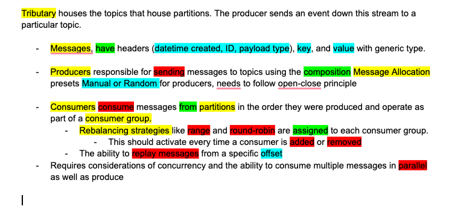

## BLOG 1:

# Task 1:

## Engineering Requirements:

## Usability Tests / Testing Plan:

1. Successful Creation of Topics, Partitions, Consumer Groups and Consumer and Producers.
   Create a topic and then a partition belonging to that topic. Create a consumer group with a topic allocation, add a consumer. Create a producer of a certain type.

   Cases:

   - Create a topic
   - Create a partition in a topic
   - Create a consumer group with a topic
   - Create a consumer within the group

2. Producing & Message Allocation
   Send a message to a partition using both manual and random methods of allocation

   Cases:

   - Send a message to a topic without a partition chosen (with Random Producer).
   - Send a message to a partition chosen (with Manual Producer)
   - Verify that message type matches topic type & producer type.

3. Message Consumption
   Consume messages from a topic and partition with a particular consumer.

   Cases:

   - Create a consumer and assign it to a partition.
   - Consume messages from the assigned partition and ensure they are consumed in chronological order
   - Test consuming messages from multiple partitions in a topic.

4. Consumer Group Rebalancing

   Cases:

   - Create a consumer group and add consumers to it.
   - Adding remove consumers from the group, ensuring rebalancing occurs correctly.

5. Message Replay
   Message replay functionality with an offset value passed in.

   Cases:

   - Consumer should consume a few events out of a list of many 3/5, then replay is ran and consumer should have reconsumed each event from the offset between 0-2. Afterwards it should still be able to consume from where it left off.

6. Parallel Consumption/Production
   Message replay functionality with an offset value passed in.

   Cases:

   - Consumer should consume a few events out of a list of many 3/5, then replay is ran and consumer should have reconsumed each event from the offset between 0-2. Afterwards it should still be able to consume from where it left off.

## Feature-Driven

The feature-driven approach allows you to focus on developing one feature at a time. This means we can see tangible progress quickly as each feature is implemented. It also allows for immediate feedback on each feature as it is completed. We can test each feature individually to ensure it works correctly before moving on to the next.

We can also prioritize the development of features based on their importance or their impact on the overall system.

Developing one feature at a time can simplify the understanding and implementation process. Each feature can be isolated, reducing the complexity of the system as we build it. This clarity is especially beneficial in educational assignments, where understanding the correlation between the theory discussed in class and its practical application is vital.

The feature-driven method facilitates early and frequent usability testing of each feature. This can be incredibly useful in ensuring that the system meets the usability criteria set out in the assignment. Since each feature is tested independently, any necessary changes can be identified and made without impacting other parts of the system.

## UML:

## Java API:

Our Java API class, the Tributary.java file will allow us to completely create, manage and use the system.
Creation:
Methods createTopic and createProducer allow users to create topics and producers, specifying their IDs, types (string or integer), and additional configurations like message allocation for producers.
Users can create consumer groups via the createConsumerGroup method, providing the group ID, associated topic ID, and rebalancing strategy.
Methods createConsumer and deleteConsumer allow for the creation and deletion of consumers within consumer groups.

Event Production and Consumption:
The API supports consuming events by specifying consumer ID, partition ID, and the number of events to consume using the consumeEvents method.
The produceEvent method enables producers to produce events to specified topics, ensuring that the producer exists and the topic is valid.

Features:
Tributary also enables setting rebalancing strategy as well as the method for the replay/playback feature.

## BLOG 2:

## Usability Tests / Testing Plan:

1. Successful Creation of Topics, Partitions, Consumer Groups and Consumer and Producers.
   Create a topic and then a partition belonging to that topic. Create a consumer group with a topic allocation, add a consumer. Create a producer of a certain type.

   Cases:

   - Create a topic
   - Create a partition in a topic
   - Create a consumer group with a topic
   - Create a consumer within the group

2. Producing & Message Allocation
   Send a message to a partition using both manual and random methods of allocation

   Cases:

   - Send a message to a topic without a partition chosen (with Random Producer).
   - Send a message to a partition chosen (with Manual Producer)
   - Verify that message type matches topic type & producer type.

3. Message Consumption
   Consume messages from a topic and partition with a particular consumer.

   Cases:

   - Create a consumer and assign it to a partition.
   - Consume messages from the assigned partition and ensure they are consumed in chronological order
   - Test consuming messages from multiple partitions in a topic.

4. Consumer Group Rebalancing

   Cases:

   - Create a consumer group and add consumers to it.
   - Adding remove consumers from the group, ensuring rebalancing occurs correctly.

5. Message Replay
   Message replay functionality with an offset value passed in.

   Cases:

   - Consumer should consume a few events out of a list of many 3/5, then replay is ran and consumer should have reconsumed each event from the offset between 0-2. Afterwards it should still be able to consume from where it left off.

6. Parallel Consumption/Production
   Message replay functionality with an offset value passed in.

   Cases:

   - Consumer should consume a few events out of a list of many 3/5, then replay is ran and consumer should have reconsumed each event from the offset between 0-2. Afterwards it should still be able to consume from where it left off.

## Design Patterns / Considerations

The Strategy Pattern is used in the RebalancingStrategy interface and its implementations RoundRobinStrategy and RangeStrategy. The RebalancingStrategy defines a method rebalance(List<Consumer> consumers, List<Partition> partitions) which is implemented differently by RoundRobinStrategy and RangeStrategy.

RoundRobinStrategy distributes partitions evenly among consumers in a circular manner. It's straightforward and ensures that all consumers roughly get an equal number of partitions, iterating over the partitions and assigning them one-by-one to each consumer in turn.

RangeStrategy divides partitions into contiguous blocks, assigning each consumer a block of partitions. The first consumer might get an additional partition to handle cases where the number of partitions isn't evenly divisible by the number of consumers.

Furthermore, generics are used accross classes to ensure type safety. A major use of this was on the topic class, where we use geenrics to handle different types of messages (e.g., Topic<String>, Topic<Integer>). This can be seen in the createTopic method, which uses generics to create topics of specific types (Topic<String> or Topic<Integer>, etc.)

The lists List<Topic<?>> and List<Producer<?>> are used to store topics and producers of any type. The wildcard ? indicates that these collections can hold objects of any generic type, providing flexibility in managing multiple types of topics and producers within the same structure.

Additionally, we used the synchronized keyword to manage concurrent accesss to shared resources. This makes sure that only one thread can execute a block of code at a time. For example, processCommand is synchronized for CLI inputs as well as consumeEvents to ensure that when a consumer reads events from a partition, no other thread can modify the underlying data structure of the partition until the operation is complete. This prevents issues such as two consumers reading the same event simultaneosly.

## Final UML

## Reflection

One of the primary challenges faced during this assignment was interpreting the abstract requirements initially provided. The specification required a deep understanding of both distributed systems and effective patterns in a way we weren't used to yet. In order to better understand and work on such a task, we decided it would be better to plan it through fully before we start -> rather than the "learn as we go approach" that we had for assignment 2. We definetly changed our development approach in that way.

## Video Link:
https://drive.google.com/file/d/1LuoQsGhwo7dMEyRXmen0nNszh11jXfcF/view?usp=sharing